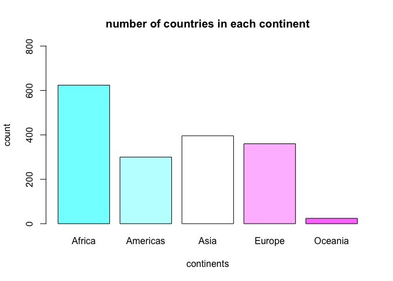
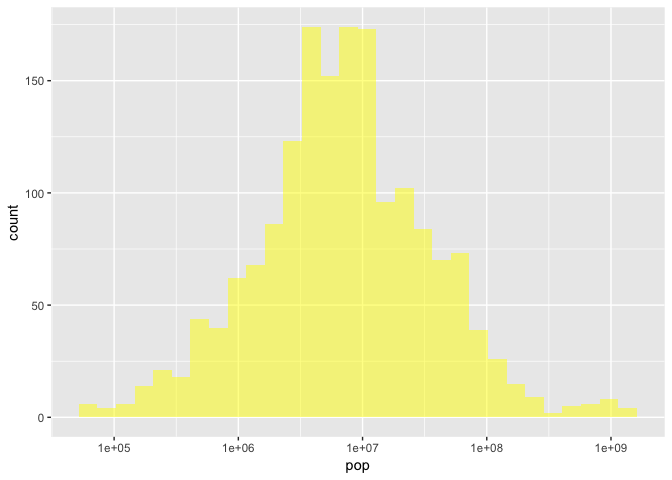
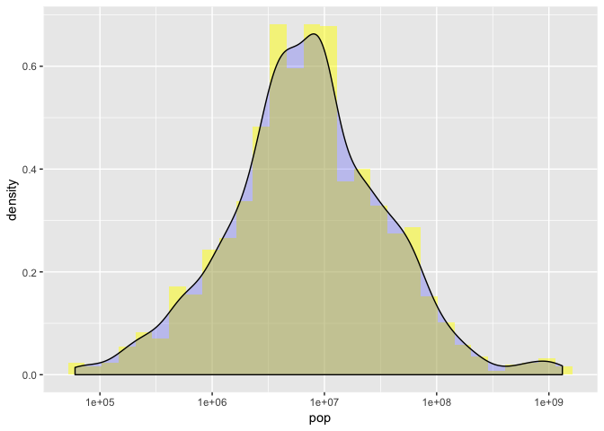
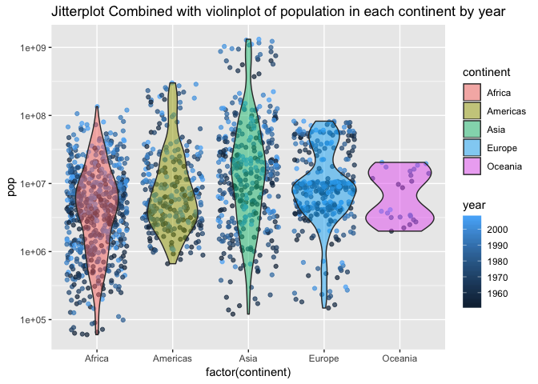

### Steps on exploration of a data frame
1. Understanding the structure of the data
    * [Bring rectangular data in]
    * [Smell test data]
2. Take a Look at of the data
    * [Explore individual variables]
3. Visulation of the data
    * [Explore individual variables]
    * [Explore various plot types]

#### Bring rectangular data in

*In this hw02, we are going to work with `gapminder` and `dplyr` data(Probably via the `tidyverse` meta-package). Install them if you have not done so already. I already intalled the packages, so I just comment out the commands.*

```r
#install.packages("gapminder")
#install.packages("tidyverse")
```

*Load them.*

```r
library(gapminder)
library(tidyverse)
```

```
## ─ Attaching packages ──────────────────── tidyverse 1.2.1 ─
```

```
## ✔ ggplot2 3.0.0     ✔ purrr   0.2.5
## ✔ tibble  1.4.2     ✔ dplyr   0.7.6
## ✔ tidyr   0.8.1     ✔ stringr 1.3.1
## ✔ readr   1.1.1     ✔ forcats 0.3.0
```

```
## ─ Conflicts ───────────────────── tidyverse_conflicts() ─
## ✖ dplyr::filter() masks stats::filter()
## ✖ dplyr::lag()    masks stats::lag()
```

```r
library(knitr)
```

#### Smell test data

*The purpose of this part is to explore `gapminder` object.*


1, **Is it a data.frame, a matrix, a vector, a list**


```r
mode(gapminder)
```

```
## [1] "list"
```

```r
typeof(gapminder)
```

```
## [1] "list"
```

*After solved my confustion about the difference between `mode` and `typeof`, I knew that they all show the type or storage mode of any object
but the set of names might be different.*

>Modes have the same set of names as types (see typeof) except that
>
>   * types "integer" and "double" are returned as "numeric".
>  
>   * types "special" and "builtin" are returned as "function".
>  
>   * type "symbol" is called mode "name".
>  
>   * type "language" is returned as "(" or "call".
>
>From [R Documentation](https://www.rdocumentation.org/packages/base/versions/3.5.1/topics/mode)

*According to words mentioned above, use`mode` and `typeof` will generate the same output `list` in `gapminder`.*

2, **What is its class?**


```r
class(gapminder)
```

```
## [1] "tbl_df"     "tbl"        "data.frame"
```

3, **How many variables/columns?**


```r
ncol(gapminder)
```

```
## [1] 6
```

4, **How many rows/observations?**


```r
nrow(gapminder)
```

```
## [1] 1704
```


5, **Can you get these facts about “extent” or “size” in more than one way? Can you imagine different functions being useful in different contexts?**

*From Q3 and Q4, dimension of `gapminder` can get repectively. 1st method works when you only need to know the dimension, while 2nd method works when you also care about the data type and want to preview the data it contained *


```r
dim(gapminder)
```

```
## [1] 1704    6
```

* Another method


```r
# Tells the dimension of the data frame,shows the name of each variable followed by its data type and the preview of data contained in it.
str(gapminder)
```

```
## Classes 'tbl_df', 'tbl' and 'data.frame':	1704 obs. of  6 variables:
##  $ country  : Factor w/ 142 levels "Afghanistan",..: 1 1 1 1 1 1 1 1 1 1 ...
##  $ continent: Factor w/ 5 levels "Africa","Americas",..: 3 3 3 3 3 3 3 3 3 3 ...
##  $ year     : int  1952 1957 1962 1967 1972 1977 1982 1987 1992 1997 ...
##  $ lifeExp  : num  28.8 30.3 32 34 36.1 ...
##  $ pop      : int  8425333 9240934 10267083 11537966 13079460 14880372 12881816 13867957 16317921 22227415 ...
##  $ gdpPercap: num  779 821 853 836 740 ...
```

6, What data type is each variable?


```r
head(gapminder)
```

```
## # A tibble: 6 x 6
##   country     continent  year lifeExp      pop gdpPercap
##   <fct>       <fct>     <int>   <dbl>    <int>     <dbl>
## 1 Afghanistan Asia       1952    28.8  8425333      779.
## 2 Afghanistan Asia       1957    30.3  9240934      821.
## 3 Afghanistan Asia       1962    32.0 10267083      853.
## 4 Afghanistan Asia       1967    34.0 11537966      836.
## 5 Afghanistan Asia       1972    36.1 13079460      740.
## 6 Afghanistan Asia       1977    38.4 14880372      786.
```

* Another method


```r
#returns a list of the same length as 'gapminder', each element of which is the result of applying CLASS to the corresponding element of 'gapminder'.
lapply(gapminder,class)
```

```
## $country
## [1] "factor"
## 
## $continent
## [1] "factor"
## 
## $year
## [1] "integer"
## 
## $lifeExp
## [1] "numeric"
## 
## $pop
## [1] "integer"
## 
## $gdpPercap
## [1] "numeric"
```


#### Explore individual variables

**Pick at least one categorical variable and at least one quantitative variable to explore.**

##### Explore categorical variable `continent`
 

  * **What are possible values (or range, whichever is appropriate) of each variable?**

  * **Feel free to use summary stats, tables, figures. We’re NOT expecting high production value (yet).**
  
  * **What values are typical? What’s the spread? What’s the distribution? Etc., tailored to the variable at hand.**
  

*After knew the data type of each variable, I picked `continent` as categorical variable and `pop` as quantitative variable. **For `continent`** *

*Firstly, to get access to the levels attribute of a variable, I used `levels`, it returns the value of the levels of its argument.*


```r
levels(gapminder$continent)
```

```
## [1] "Africa"   "Americas" "Asia"     "Europe"   "Oceania"
```

*Also, to get distinct arguments of variable `continent`, I used `unique`*


```r
unique(gapminder$continent)
```

```
## [1] Asia     Europe   Africa   Americas Oceania 
## Levels: Africa Americas Asia Europe Oceania
```

*After that, `summary` is chosen to describe the result summaries.* 


```r
summary(gapminder$continent) %>% 
    knitr::kable()
```

              x
---------  ----
Africa      624
Americas    300
Asia        396
Europe      360
Oceania      24


```r
continent.counts <- table(gapminder$continent)
continent.counts
```

```
## 
##   Africa Americas     Asia   Europe  Oceania 
##      624      300      396      360       24
```

```r
continent.prop <- continent.counts / sum(continent.counts)
continent.prop
```

```
## 
##     Africa   Americas       Asia     Europe    Oceania 
## 0.36619718 0.17605634 0.23239437 0.21126761 0.01408451
```

*After the exploration on the number of countries in each continent. Barplot is applied to display the counts of categorial variable*


```r
barplot(continent.counts, col = cm.colors(length(continent.counts)), xlab = "continents", ylab = "count",xlim = NULL, ylim =c(0,800), main = "number of countries in each continent")
```

<!-- -->

*To get a more directly overview of each continent, I converted counts of each continent to proportions and visualized the proportions in a pie chart.*
  

```r
lab <- levels(gapminder$continent)
piepercent <- round(100*continent.prop,1)
pie(continent.counts,labels = piepercent, 
    main="Pie Chart of the  Proportions of each contient",
    col = terrain.colors(length(continent.counts)))
legend("topright",lab,cex=0.7,
       fill = terrain.colors(length(continent.counts)))
```

<!-- -->

  
  
##### Explore quantitative variable `pop` 

  * **What are possible values (or range, whichever is appropriate) of each variable?**
  
  * **What values are typical? What’s the spread? What’s the distribution? Etc., tailored to the variable at hand.**
  
  * **Feel free to use summary stats, tables, figures. We’re NOT expecting high production value (yet).**
  
*For quantitative variable `pop`, it's good to obtain the range of it by `range` and minimum, 1st quartiles, median, mean, 3rd quartiles and maximum values by `summary` at first.*
  

```r
  range(gapminder$pop)
```

```
## [1]      60011 1318683096
```

```r
  summary(gapminder$pop)
```

```
##      Min.   1st Qu.    Median      Mean   3rd Qu.      Max. 
## 6.001e+04 2.794e+06 7.024e+06 2.960e+07 1.959e+07 1.319e+09
```

*To preview the first and last 5th line of `pop` variable*

```r
head(gapminder$pop,n=5)
```

```
## [1]  8425333  9240934 10267083 11537966 13079460
```

```r
tail(gapminder$pop,n=5)
```

```
## [1]  9216418 10704340 11404948 11926563 12311143
```

*Check the distribution of the `pop` variable*

```r
gapminder %>%
  ggplot(aes(x=pop)) +
  geom_histogram(bins=30,fill='yellow',alpha=0.5) +
  scale_x_log10()
```

<!-- -->

*Combination of histogram and density plot*

```r
gapminder %>%
  ggplot(aes(pop)) +
  geom_histogram(aes(y=..density..),bins=30,fill='yellow',alpha=0.5) +
  geom_density(alpha=0.2,fill='blue') +
  scale_x_log10()
```

<!-- -->

#### Explore various plot types
**Make a few plots, probably of the same variable you chose to characterize numerically. You can use the plot types we went over in class (cm006) to get an idea of what you’d like to make. Try to explore more than one plot type. Just as an example of what I mean:**

    A scatterplot of two quantitative variables.
    A plot of one quantitative variable. Maybe a histogram or densityplot or frequency polygon.
    A plot of one quantitative variable and one categorical. Maybe boxplots for several continents or countries.
    
**You don’t have to use all the data in every plot! It’s fine to filter down to one country or small handful of countries.**

*We can explore the relationship between population and year in each continent*


```r
ggplot(gapminder,aes(factor(continent),pop , color = year)) + 
  scale_y_log10() +
  geom_jitter(alpha = 0.7) +
  geom_violin(aes(fill = continent),alpha = 0.5) +
  labs(title = "Jitterplot Combined with violinplot of population in each continent by year")
```

<!-- -->

*From this plot, it can be noticed that the range of population in Asia is higher than other continents, and the population density in Oceania is lower in almost any time.*

*I'm going to use scatterplot to display the relationship between `lifeExp`,`gdpPercap` in each continent in different years*


```r
ggplot( gapminder, aes(x=gdpPercap , y=lifeExp, color=pop)) + 
  geom_point(size=1,alpha=0.3) + 
  scale_color_continuous(trans="log10",low="#000099",high="#FF0000",space="Lab") 
```

<!-- -->


*From the output plot,I think `gdpPercap` is increase with the increase of `lifeExp`,the same trend of population might also works.*

*I will now make a conparision between the population of each continent in the year of 1977.*


```r
d <- gapminder %>%
  filter(year==1977)

ggplot(d, aes(x=continent, y=pop, fill=continent)) + 
    geom_boxplot(alpha=0.3) +
    scale_y_log10() 
```

<!-- -->


*After observation, the population of Asia and the range of it is higher than other areas.*

#### Use filter(), select() and %>%

**Use filter() to create data subsets that you want to plot.**

    Practice piping together filter() and select(). Possibly even piping into ggplot().


*In the following part,I will install `plotly` library to get an interactive version, unfortunately, the interactive version isn't fit for github, but it works well in R.* 

*To take a preview, I uploaded the 'gif' effect, hope you still enjoy it.*

*If you still want to explore the interactive version by yourself, please feel free to download the `.Rmd` file.*
*The purpose of this interactive version output is to fint out the exact value of some variables(`lifeExp`,`gdpPercap`,`pop`,`continent`) in the year of 1967.*

```
#install.packages("plotly")
library(ggplot2)
library(plotly)
a <- gapminder %>%
  select(-country) %>%
  filter(year==1967) %>%
  ggplot( aes(lifeExp,gdpPercap,size = pop, color=continent)) +
  geom_point() +
  scale_y_log10() +
  theme_bw()
 
ggplotly(a)
```


#### But I want to do more!

**Evaluate this code and describe the result. Presumably the analyst’s intent was to get the data for Rwanda and Afghanistan. Did they succeed? Why or why not? If not, what is the correct way to do this?**
`filter(gapminder, country == c("Rwanda", "Afghanistan"))`

    Read [What I do when I get a new data set as told through     tweets](https://simplystatistics.org/2014/06/13/what-i-do-when-i-get-a-new-data-set-as-told-through-tweets/) from [SimplyStatistics](https://simplystatistics.org/) to get some ideas!

    Present numerical tables in a more attractive form, such as using `knitr::kable()`.

    Use more of the dplyr functions for operating on a single table.

    Adapt exercises from the chapters in the “Explore” section of [R for Data Science](http://r4ds.had.co.nz/) to the Gapminder dataset.

*To vertify whether it's correct or not, just run it*


```r
gapminder %>%
  filter(country == c("Rwanda", "Afghanistan")) %>%
  knitr::kable()
```


country       continent    year   lifeExp        pop   gdpPercap
------------  ----------  -----  --------  ---------  ----------
Afghanistan   Asia         1957    30.332    9240934    820.8530
Afghanistan   Asia         1967    34.020   11537966    836.1971
Afghanistan   Asia         1977    38.438   14880372    786.1134
Afghanistan   Asia         1987    40.822   13867957    852.3959
Afghanistan   Asia         1997    41.763   22227415    635.3414
Afghanistan   Asia         2007    43.828   31889923    974.5803
Rwanda        Africa       1952    40.000    2534927    493.3239
Rwanda        Africa       1962    43.000    3051242    597.4731
Rwanda        Africa       1972    44.600    3992121    590.5807
Rwanda        Africa       1982    46.218    5507565    881.5706
Rwanda        Africa       1992    23.599    7290203    737.0686
Rwanda        Africa       2002    43.413    7852401    785.6538

`Still not sure, let's run it seperately`


```r
knitr::kable(filter(gapminder, country == c("Rwanda")))
```


country   continent    year   lifeExp       pop   gdpPercap
--------  ----------  -----  --------  --------  ----------
Rwanda    Africa       1952    40.000   2534927    493.3239
Rwanda    Africa       1957    41.500   2822082    540.2894
Rwanda    Africa       1962    43.000   3051242    597.4731
Rwanda    Africa       1967    44.100   3451079    510.9637
Rwanda    Africa       1972    44.600   3992121    590.5807
Rwanda    Africa       1977    45.000   4657072    670.0806
Rwanda    Africa       1982    46.218   5507565    881.5706
Rwanda    Africa       1987    44.020   6349365    847.9912
Rwanda    Africa       1992    23.599   7290203    737.0686
Rwanda    Africa       1997    36.087   7212583    589.9445
Rwanda    Africa       2002    43.413   7852401    785.6538
Rwanda    Africa       2007    46.242   8860588    863.0885

```r
knitr::kable(filter(gapminder, country == c("Afghanistan")))
```


country       continent    year   lifeExp        pop   gdpPercap
------------  ----------  -----  --------  ---------  ----------
Afghanistan   Asia         1952    28.801    8425333    779.4453
Afghanistan   Asia         1957    30.332    9240934    820.8530
Afghanistan   Asia         1962    31.997   10267083    853.1007
Afghanistan   Asia         1967    34.020   11537966    836.1971
Afghanistan   Asia         1972    36.088   13079460    739.9811
Afghanistan   Asia         1977    38.438   14880372    786.1134
Afghanistan   Asia         1982    39.854   12881816    978.0114
Afghanistan   Asia         1987    40.822   13867957    852.3959
Afghanistan   Asia         1992    41.674   16317921    649.3414
Afghanistan   Asia         1997    41.763   22227415    635.3414
Afghanistan   Asia         2002    42.129   25268405    726.7341
Afghanistan   Asia         2007    43.828   31889923    974.5803

*By observation, it seems like the 1st method overlapped some data since the 2 countries appeared in the same year. To solve the problem, by introducing `%in%`, it is value matching and  "returns a vector of the positions of (first) matches of its first argument in its second", while `==` is logical operator, in this case, which means some variables are overlapped since one of its attribute(eg. year) happened to be the same. Fixed version:*


```r
gapminder %>%
  filter(country %in% c("Rwanda", "Afghanistan")) %>%
  knitr::kable()
```


country       continent    year   lifeExp        pop   gdpPercap
------------  ----------  -----  --------  ---------  ----------
Afghanistan   Asia         1952    28.801    8425333    779.4453
Afghanistan   Asia         1957    30.332    9240934    820.8530
Afghanistan   Asia         1962    31.997   10267083    853.1007
Afghanistan   Asia         1967    34.020   11537966    836.1971
Afghanistan   Asia         1972    36.088   13079460    739.9811
Afghanistan   Asia         1977    38.438   14880372    786.1134
Afghanistan   Asia         1982    39.854   12881816    978.0114
Afghanistan   Asia         1987    40.822   13867957    852.3959
Afghanistan   Asia         1992    41.674   16317921    649.3414
Afghanistan   Asia         1997    41.763   22227415    635.3414
Afghanistan   Asia         2002    42.129   25268405    726.7341
Afghanistan   Asia         2007    43.828   31889923    974.5803
Rwanda        Africa       1952    40.000    2534927    493.3239
Rwanda        Africa       1957    41.500    2822082    540.2894
Rwanda        Africa       1962    43.000    3051242    597.4731
Rwanda        Africa       1967    44.100    3451079    510.9637
Rwanda        Africa       1972    44.600    3992121    590.5807
Rwanda        Africa       1977    45.000    4657072    670.0806
Rwanda        Africa       1982    46.218    5507565    881.5706
Rwanda        Africa       1987    44.020    6349365    847.9912
Rwanda        Africa       1992    23.599    7290203    737.0686
Rwanda        Africa       1997    36.087    7212583    589.9445
Rwanda        Africa       2002    43.413    7852401    785.6538
Rwanda        Africa       2007    46.242    8860588    863.0885

